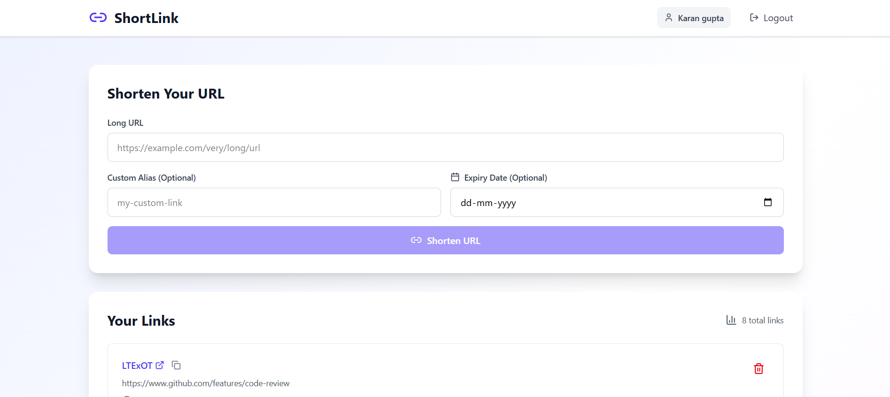

<!-- # **Scalable URL Shortener Service**

A production-grade **URL Shortening Service** designed with **microservice architecture** and **auto-scaling** in mind — capable of handling millions of users efficiently.

This project demonstrates a complete end-to-end scalable backend system, covering:

* Distributed ID generation using **Snowflake algorithm + ZooKeeper**
* **Caching**, **load balancing**.
* **Microservices** communication via REST APIs
* **Auto-scaling deployment** on **Kubernetes**

---

## **Architecture Overview**

The system is built using a **microservices-based architecture**.
Each service is independent, owns its own data, and communicates through APIs.

### Core Microservices

1. **Auth Service** – Manages users and authentication.
2. **URL Shortening Service** – Generates short URLs using distributed IDs.
3. **Redirect Service** – Handles fast redirection to original URLs.
4. **API Gateway** – Routes external requests to appropriate microservices.

---

## **Tech Stack and Justifications**

| Component                     | Technology                          | Reason / Use Case                                                                                                         |
| ----------------------------- | ----------------------------------- | ------------------------------------------------------------------------------------------------------------------------- |
| **Backend Framework**         | Node.js + Express.js                | Non-blocking, event-driven I/O — perfect for scalable microservices. Easy API design and async operations.                |
| **Frontend**                  | React.js                            | To build the user dashboard and analytics UI for users (optional for internal UI).                                        |
| **Database (Users)**          | **MongoDB**                         | Stores user info and auth details. Flexible document schema fits user metadata perfectly.                                 |
| **Database (URLs)**           | **Cassandra**                       | High write throughput, horizontal scalability, and fast distributed read performance — ideal for millions of URL records. |
| **Cache Layer**               | **Redis (with TTL)**                | Used to store `{ short → long }` mappings for ultra-fast redirect lookups and automatic expiry of inactive URLs.          |
| **Distributed ID Generation** | **Snowflake Algorithm + ZooKeeper** | Ensures globally unique short URL IDs across distributed instances by managing `worker IDs` and `local counters`.         |
| **API Gateway**               | **NGINX / Express Gateway**         | Routes requests from users to respective microservices and balances load among instances.                                 |
| **Containerization**          | **Docker**                          | Packages each service into lightweight containers for easy deployment and isolation.                                      |
| **Orchestration**             | **Kubernetes (K8s)**                | Enables auto-scaling, load balancing, self-healing, and rolling deployments across all microservices.                     |
---

## **Microservices Explained**

### 1. **Auth Service**

* Manages **user registration, login, and JWT-based authentication**.
* Uses **MongoDB** to store:

  ```js
  {
    _id: ObjectId,
    name: String,
    email: String,
    passwordHash: String,
    mobile: String,
    createdAt: Date
  }
  ```
* Handles token validation for protected APIs.

---

### 2. **URL Shortening Service**

* Accepts a long URL and generates a unique short URL using:

  ```
  Snowflake ID → Base64 encoding → first 6 characters
  ```
* Uses **ZooKeeper** to assign a unique `workerId` to each running service instance.
* Stores URL details in **Cassandra**:

  ```sql
  CREATE TABLE urls (
    short_id TEXT PRIMARY KEY,
    long_url TEXT,
    user_id TEXT,
    created_at TIMESTAMP,
    expiry TIMESTAMP
  );
  ```
* Pushes `{short_id → long_url}` mapping into **Redis** with TTL.
* Runs **cron jobs** to periodically delete expired links from Cassandra.

---

### 3. **Redirect Service**

* Handles requests like `https://short.ly/abc123`.
* Flow:

  1. Looks up the short code in **Redis**.
  2. If found → instant redirect (O(1)).
  3. If not found → query Cassandra → repopulate Redis.
* Most frequently accessed microservice (optimized for speed).

---

### 4. **API Gateway**

* Receives all external traffic.
* Uses **NGINX** or **Express Gateway** to:

  * Route requests to the correct microservice.
  * Handle rate limiting, authentication, and caching at the edge.
* Balances requests among multiple service instances.


---

## **Data Flow**

1. **User Login:**

   * User logs in → Auth Service validates and issues JWT.
2. **URL Shortening:**

   * User sends `POST /shorten` → validated by API Gateway → URL Service.
   * Snowflake generates ID → stores in Cassandra → caches in Redis.
3. **Redirection:**

   * Visitor requests `/abc123`.
   * Redirect Service checks Redis → if not found, queries Cassandra.
4. **Expiry:**

   * Redis TTL auto-expires the key.
   * Cron job removes expired records from Cassandra.

---

## **Scalability and Fault Tolerance**

* **Microservice-based** → each service scales independently.
* **Redis Cluster** → avoids single point of failure.
* **Cassandra’s distributed architecture** → ensures no downtime if a node fails.
* **ZooKeeper** → ensures unique ID assignment even if services restart.
* **Kubernetes Auto-Scaling** → adjusts replicas based on CPU/memory usage.
* **Load Balancers (NGINX/K8s)** → distribute traffic evenly.

---

## **Why This Design Works in Production**

* **High availability** — every layer is replicated and stateless.
* **Observability built-in** — allows real-time debugging and scaling decisions.
* **Resilient to failures** — auto-healing and self-recovery mechanisms.
* **Cache-optimized** — majority of requests never hit the database.
* **Horizontal scalability** — every tier can scale independently.

---

## **Deployment Flow**

1. **Build Docker images** for each microservice:

   ```bash
   docker build -t auth-service .
   docker build -t url-service .
   docker build -t redirect-service .
   ```
2. **Push to registry** (e.g., Docker Hub or AWS ECR).
3. **Apply Kubernetes manifests**:

   ```bash
   kubectl apply -f k8s/
   ```
4. **Monitor in Grafana**, adjust autoscaling rules as needed.

---

## **Example API Endpoints**

### Auth Service

```
POST /api/auth/register
POST /api/auth/login
GET /api/auth/me
```

### URL Service

```
POST /api/url/shorten
GET /api/url/:shortId
DELETE /api/url/:shortId
GET /api/url/all
```

### Redirect Service

```
GET /:shortId  → 302 Redirect to long URL
```

---

## **Future Improvements**

* Add **custom short URLs**.
* Add **analytics tracking** (click count, user insights).
* Add **user plans (Free / Premium)** with rate limits.
* Integrate **CI/CD pipeline** with GitHub Actions.
* Implement **service mesh (Istio/Linkerd)** for more secure service-to-service communication. -->


# **Scalable URL Shortener – Microservices Architecture**

A **production-grade distributed URL Shortener System** designed using **microservice architecture**, built for **scalability**, **observability**, and **auto-scaling**. Each service is containerized, independently deployable, and built to handle high-traffic workloads efficiently.

This project demonstrates how to design and build a **real-world scalable backend system** following industry best practices, capable of handling millions of users efficiently.


[View Demo Video](https://github.com/karangupta982/system-design/issues/1#issue-3747832581)



---

## **Overview**

This project combines **Node.js microservices**, **Cassandra**, **MongoDB**, **Redis**, and **ZooKeeper** for distributed coordination.

The system handles:

* Short URL generation using **Snowflake IDs**
* Fast redirection using **Redis caching**
* Independent **authentication and authorization**
* API Gateway for centralized routing and rate limiting
* Distributed ID generation using **Snowflake algorithm + ZooKeeper**
* **Auto-scaling deployment** on **Kubernetes**

---

## **Microservices and Repositories**

| Service                 | Description                                                                                                                                     | Repository                                                                                      |
| ----------------------- | ----------------------------------------------------------------------------------------------------------------------------------------------- | ----------------------------------------------------------------------------------------------- |
| **Auth Service**  | Manages user registration, login, and JWT authentication. Uses MongoDB for storage.                                                             | [url-shortner-auth-service](https://github.com/karangupta982/url-shortner-auth-service)         |
| **URL Service**      | Generates short URLs using distributed Snowflake IDs and stores them in Cassandra (DataStax Astra DB). Uses ZooKeeper for worker ID management. | [url-shortner-urlservice](https://github.com/karangupta982/url-shortner-urlservice)             |
| **Redirect Service**  | Handles redirection from short URLs to long URLs using Redis caching (fast lookup).                                                             | [url-shortner-redirect-service](https://github.com/karangupta982/url-shortner-redirect-service) |
| **API Gateway**      | Entry point for all requests. Handles routing, rate limiting, and authentication across services.                                               | [url-shortner-api-gateway](https://github.com/karangupta982/url-shortner-api-gateway)           |
| **Frontend (React)** | User interface for creating and managing short URLs. Connects to API Gateway for communication with backend services.                           | [url-shortner-frontend](https://github.com/karangupta982/url-shortner-frontend)                 |

---

## **Architecture Diagram**

```
                   ┌────────────────────┐
                   │    Frontend (React)│
                   │  (User Dashboard)  │
                   └─────────┬──────────┘
                             │
                             ▼
                   ┌────────────────────┐
                   │    API Gateway     │
                   │ (Routing & Auth)   │
                   └─────────┬──────────┘
     ┌────────────────────────┼────────────────────────┐
     ▼                        ▼                        ▼
┌──────────────┐       ┌───────────────┐         ┌────────────────┐
│ Auth Service │       │ URL Service   │         │ Redirect Service│
│ MongoDB      │       │ Cassandra     │         │ Redis Cache     │
│ JWT Tokens   │       │ Snowflake ID  │         │ Short→Long Map  │
└──────────────┘       └───────────────┘         └────────────────┘
                             │
                             ▼
                   ┌────────────────────┐
                   │   ZooKeeper (ID)   │
                   │ Worker ID mgmt.    │
                   └────────────────────┘
```

---

## **Tech Stack and Justifications**

| Component                     | Technology                          | Reason / Use Case                                                                                                         |
| ----------------------------- | ----------------------------------- | ------------------------------------------------------------------------------------------------------------------------- |
| **Frontend**                  | React + Tailwind CSS                | Responsive UI for creating and managing short URLs. User dashboard and analytics UI.                                      |
| **Backend Framework**         | Node.js + Express.js                | Non-blocking, event-driven I/O — perfect for scalable microservices. Easy API design and async operations.                |
| **Database (Users)**          | **MongoDB**                         | Stores user info and auth details. Flexible document schema fits user metadata perfectly.                                 |
| **Database (URLs)**           | **Cassandra (DataStax Astra)**      | High write throughput, horizontal scalability, and fast distributed read performance — ideal for millions of URL records. |
| **Cache Layer**               | **Redis (with TTL)**                | Ultra-fast redirect lookups and automatic expiry of inactive URLs. Stores `{ short → long }` mappings.                    |
| **Distributed Coordination**  | **Apache ZooKeeper**                | Ensures globally unique short URL IDs across distributed instances by managing `worker IDs` and `local counters`.         |
| **Distributed ID Generation** | **Snowflake Algorithm + ZooKeeper** | Worker ID management for generating unique IDs across distributed service instances.                                      |
| **API Gateway**               | **Express Gateway / NGINX**         | Centralized routing, load balancing, rate limiting, and authentication. Routes requests to appropriate microservices.     |
| **Authentication**            | **JWT Tokens**                      | Stateless user authentication for protected APIs.                                                                         |
| **Containerization**          | **Docker**                          | Packages each service into lightweight containers for easy deployment and isolation.                                      |
| **Orchestration**             | **Kubernetes (K8s)**                | Enables auto-scaling, load balancing, self-healing, and rolling deployments across all microservices.                     |
| **Monitoring (optional)**     | **Prometheus + Grafana**            | Collects metrics, visualizes performance dashboards, and tracks observability for real-time debugging.                    |

---

## **Microservices Explained**

### 1. **Auth Service**

* Manages **user registration, login, and JWT-based authentication**
* Uses **MongoDB** to store user data:

  ```javascript
  {
    _id: ObjectId,
    name: String,
    email: String,
    passwordHash: String,
    mobile: String,
    createdAt: Date
  }
  ```
* Handles token validation for protected APIs
* Issues JWT tokens upon successful authentication

**Endpoints:**
```
POST /api/auth/register
POST /api/auth/login
GET /api/auth/me
```

---

### 2. **URL Shortening Service**

* Accepts a long URL and generates a unique short URL using:
  ```
  Snowflake ID → Base64 encoding → first 6 characters
  ```
* Uses **ZooKeeper** to assign a unique `workerId` to each running service instance
* Stores URL details in **Cassandra**:

  ```sql
  CREATE TABLE urls (
    short_id TEXT PRIMARY KEY,
    long_url TEXT,
    user_id TEXT,
    created_at TIMESTAMP,
    expiry TIMESTAMP
  );
  ```
* Pushes `{short_id → long_url}` mapping into **Redis** with TTL
* Runs **cron jobs** to periodically delete expired links from Cassandra

**Endpoints:**
```
POST /api/url/shorten
GET /api/url/:shortId
DELETE /api/url/:shortId
GET /api/url/all
```

---

### 3. **Redirect Service**

* Handles redirection from short URLs to long URLs (e.g., `https://short.ly/abc123`)
* **Flow:**
  1. Looks up the short code in **Redis** (O(1) lookup)
  2. If found → instant redirect (302)
  3. If not found → query Cassandra → repopulate Redis → redirect
* Most frequently accessed microservice (optimized for speed)

**Endpoint:**
```
GET /:shortId  → 302 Redirect to long URL
```

---

### 4. **API Gateway**

* Entry point for all external traffic
* Uses **NGINX** or **Express Gateway** to:
  * Route requests to the correct microservice
  * Handle rate limiting, authentication, and caching at the edge
  * Balance requests among multiple service instances
* Validates JWT tokens before forwarding requests to protected services

---

## **Data Flow**

### 1. **User Login**

* User registers or logs in via the **Auth Service**
* Receives a **JWT token** for authenticated actions
* Auth Service validates credentials and issues token

### 2. **Shorten URL**

* Frontend sends `POST /shorten` to API Gateway → URL Service
* URL Service:
  * Connects to **ZooKeeper** to fetch a unique `workerId`
  * Generates a **Snowflake ID**, encodes it (Base64), and shortens it
  * Stores `{ short_id, long_url, user_id, expiry }` in **Cassandra**
  * Caches in **Redis** for fast lookups with TTL

### 3. **Redirect**

* When someone visits `/abc123`, the **Redirect Service**:
  * Checks **Redis** for `{ short_id → long_url }` (cache hit)
  * If not found, queries **Cassandra**, then re-caches it
  * Redirects user with HTTP 302

### 4. **Expiry Handling**

* Redis uses TTL for automatic cache expiration
* Cron jobs periodically clean up expired URLs from Cassandra
* Expired links return 404 or custom expiry message

---

## **Scalability and Fault Tolerance**

* **Microservice isolation** → each service scales independently based on load
* **Redis Cluster** → avoids single point of failure with distributed caching
* **Cassandra's distributed architecture** → ensures no downtime if a node fails
* **ZooKeeper coordination** → ensures unique ID assignment even if services restart
* **Kubernetes Auto-Scaling** → adjusts replicas based on CPU/memory usage (HPA)
* **Load Balancers (NGINX/K8s)** → distribute traffic evenly across instances
* **Cache-optimized** → majority of requests never hit the database
* **Horizontal scalability** → every tier can scale independently
* **High availability** → every layer is replicated and stateless
* **Resilient to failures** → auto-healing and self-recovery mechanisms

---

## **Deployment Overview**

Each microservice has:

* Its own **Dockerfile**
* Its own **Kubernetes Deployment & Service YAML**
* Independent CI/CD pipeline support

### **Deployment Flow**

#### Step 1: Build Docker images

```bash
docker build -t karangupta982/auth-service ./auth-service
docker build -t karangupta982/url-service ./url-service
docker build -t karangupta982/redirect-service ./redirect-service
docker build -t karangupta982/api-gateway ./api-gateway
docker build -t karangupta982/frontend ./frontend
```

#### Step 2: Push to Docker Hub

```bash
docker push karangupta982/auth-service
docker push karangupta982/url-service
docker push karangupta982/redirect-service
docker push karangupta982/api-gateway
docker push karangupta982/frontend
```

#### Step 3: Apply Kubernetes deployments

```bash
kubectl apply -f k8s/zookeeper-deployment.yaml
kubectl apply -f k8s/redis-deployment.yaml
kubectl apply -f k8s/auth-deployment.yaml
kubectl apply -f k8s/url-deployment.yaml
kubectl apply -f k8s/redirect-deployment.yaml
kubectl apply -f k8s/gateway-deployment.yaml
kubectl apply -f k8s/frontend-deployment.yaml
```

#### Step 4: Monitor in Grafana

Adjust autoscaling rules as needed based on metrics and performance data.

---

## **Why This Design Works in Production**

* **High availability** — every layer is replicated and stateless
* **Observability built-in** — allows real-time debugging and scaling decisions
* **Resilient to failures** — auto-healing and self-recovery mechanisms
* **Cache-optimized** — majority of requests never hit the database
* **Horizontal scalability** — every tier can scale independently
* **Microservice-based** — services can be deployed, scaled, and updated independently
* **Distributed coordination** — ZooKeeper ensures unique IDs across all instances
* **Performance optimized** — Redis caching minimizes database reads

---

## **Future Enhancements**

* Add **link analytics service** (track visits, referrers, devices, and geographic data)
* Add **custom short URL alias support** for branded links
* Integrate **Prometheus & Grafana** for comprehensive observability
* Implement **service mesh (Istio/Linkerd)** for better service-to-service security
* Add **CI/CD pipelines** (GitHub Actions or Jenkins)
* Add **user plans (Free / Premium)** with different rate limits
* Integrate **message broker (Kafka/RabbitMQ)** for async operations
* Add **distributed tracing (OpenTelemetry/Jaeger)** for debugging latency
* Implement **A/B testing** for feature rollouts
* Add **bulk URL shortening** via CSV upload

---

## **Project Repositories**

| Component            | Repository Link                                                                                                                  |
| -------------------- | -------------------------------------------------------------------------------------------------------------------------------- |
| **Auth Service**     | [https://github.com/karangupta982/url-shortner-auth-service](https://github.com/karangupta982/url-shortner-auth-service)         |
| **URL Service**      | [https://github.com/karangupta982/url-shortner-urlservice](https://github.com/karangupta982/url-shortner-urlservice)             |
| **Redirect Service** | [https://github.com/karangupta982/url-shortner-redirect-service](https://github.com/karangupta982/url-shortner-redirect-service) |
| **API Gateway**      | [https://github.com/karangupta982/url-shortner-api-gateway](https://github.com/karangupta982/url-shortner-api-gateway)           |
| **Frontend**         | [https://github.com/karangupta982/url-shortner-frontend](https://github.com/karangupta982/url-shortner-frontend)                 |

---

## **Key Learning Outcomes**

* How to design and build **distributed microservice systems**
* Using **ZooKeeper** for distributed coordination and unique ID generation
* Integrating **MongoDB**, **Cassandra**, and **Redis** together in a single system
* Implementing **JWT-based authentication** and authorization
* Managing services with **Docker and Kubernetes**
* Understanding **Snowflake algorithm** for distributed ID generation
* Ensuring scalability, fault tolerance, and observability
* Building production-grade systems with real-world best practices
* Implementing caching strategies for performance optimization
* Designing RESTful APIs for microservices communication

---

## **Acknowledgments**

* Inspired by industry-standard URL shortening services like Bitly and TinyURL
* Thanks to the open-source community for excellent tools and libraries
* Special thanks to contributors and reviewers

---

**Star this repository if you find it helpful!**